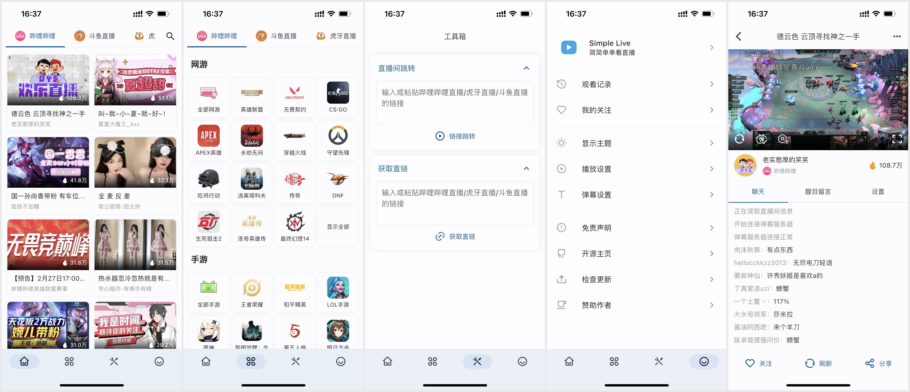
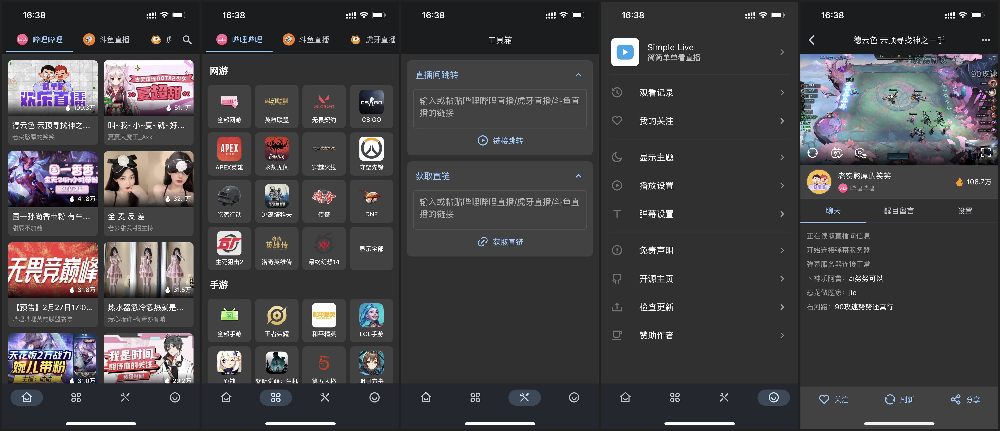

<p align="center"></p>

<h1 align="center">Simple Live</h1>

<p align="center">简简单单看直播 · 支持哔哩哔哩、虎牙、斗鱼、抖音</p>

<p align="center"><a href="https://github.com/xiaofeng3539/dart_simple_live/releases/tag/v1.11.4">下载正式版 v1.11.4</a> · <a href="CHANGELOG.md">版本记录</a> · <a href="LICENSE">开源许可</a></p>





## 主要功能

- **浏览直播：** 按平台查看推荐和分类，浏览关注的主播及观看记录；可从分类页进入直播间，并查看同类游戏主播。
- **网页搜索：** 在应用内打开四个平台的网站进行搜索，识别直播间地址后可选择用 Simple Live 播放器观看。普通搜索页不会直接触发直播间跳转。
- **直播播放：** 提供清晰度与线路切换、弹幕及屏蔽设置、音量与亮度控制、小窗播放、定时关闭等功能；具体选项随平台和设备能力而异。
- **关注与账号：** 管理关注列表；提供哔哩哔哩账号登录入口。
- **链接解析：** 粘贴直播间链接获取可用播放地址；打开解析页时可识别剪贴板中的直播链接。
- **数据同步：** 支持局域网设备同步、房间号远程同步和 WebDAV 备份／恢复；手机端可扫码加入房间或局域网设备。
- **桌面操作：** Windows 版支持系统托盘、播放器快捷键及鼠标滚轮调节音量。

直播网站、接口及播放地址由各平台提供，平台调整或网络限制可能影响个别功能。远程房间同步依赖第三方服务；局域网同步要求设备位于可互访的网络。

## 平台与下载

| 平台 | 本次发布 | 说明 |
| --- | --- | --- |
| Windows x64 | 正式版 ZIP | 完整解压后运行 `simple_live_app.exe`，保留同目录的 DLL 和 `data` 文件夹。 |
| Android | 正式版 APK | 下载安装 APK；扫码功能需要相机权限。 |
| iOS、macOS、Linux | 源码 | 仓库包含对应 Flutter 工程，本次未提供经过验证的安装包。 |
| Android TV | 独立源码工程 | 位于 `simple_live_tv_app`，本次未提供安装包。 |

下载地址：[GitHub Releases](https://github.com/xiaofeng3539/dart_simple_live/releases/tag/v1.11.4)。应用版本为 `1.11.4+11104`。此版本尚未覆盖所有设备和网站场景的实机验收；已知验证限制见 Release 说明。

## 从源码构建

项目使用 Flutter 3.44.8。进入 `simple_live_app` 目录后安装依赖，再按目标平台构建：

```powershell
flutter pub get
flutter build windows --release
flutter build apk --release
```

Windows 构建需要桌面开发工具；Android 构建需要 Android SDK 和 JDK。Windows 可执行文件位于 `build/windows/x64/runner/Release`，发布时应打包该完整目录；APK 位于 `build/app/outputs/flutter-apk/app-release.apk`。自行构建 Android 正式包时还需要配置自己的签名信息。

## 项目结构

- `simple_live_core`：各平台直播信息、播放地址和弹幕的核心实现。
- `simple_live_app`：Flutter 手机与桌面客户端。
- `simple_live_tv_app`：Android TV 客户端工程。
- `simple_live_console`：核心库的控制台示例。

## 支持开发

如果这个项目对你有帮助，可以自愿使用以下微信收款码支持开发。捐款不影响软件功能或问题反馈。

<p align="center"></p>

## 参考与致谢

本项目基于 [AllLive](https://github.com/xiaoyaocz/AllLive) 等开源项目及公开资料开发。相关参考包括 [dart_tars_protocol](https://github.com/xiaoyaocz/dart_tars_protocol.git)、[real-url](https://github.com/wbt5/real-url)、[Bilibili-Live-API](https://github.com/lovelyyoshino/Bilibili-Live-API)、[danmaku](https://github.com/IsoaSFlus/danmaku)、[huya-danmu](https://github.com/BacooTang/huya-danmu)、[Tars](https://github.com/TarsCloud/Tars)、[douyin-live](https://github.com/YunzhiYike/douyin-live) 和 [Tiktok_Signature](https://github.com/5ime/Tiktok_Signature)。感谢原作者与贡献者。

## 声明

本项目用于学习和交流。直播内容、平台账号与相关服务由各平台提供；请遵守对应平台规则及当地法律法规。如果项目内容涉及您的合法权益，请联系维护者处理。
